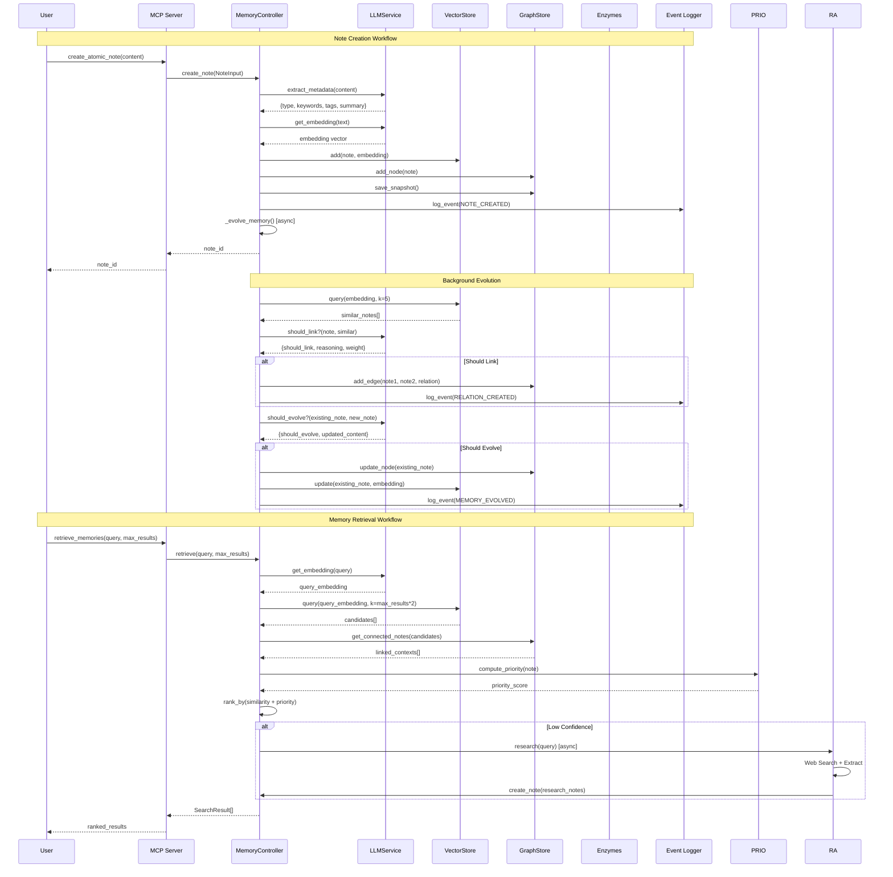
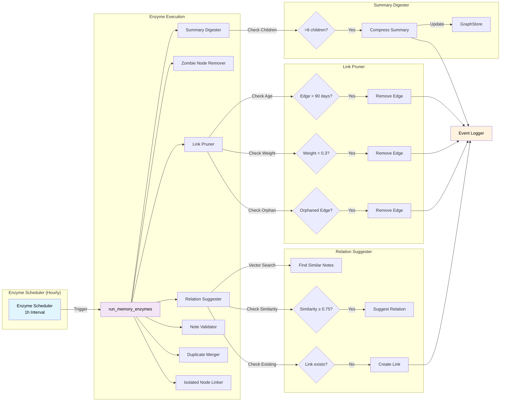
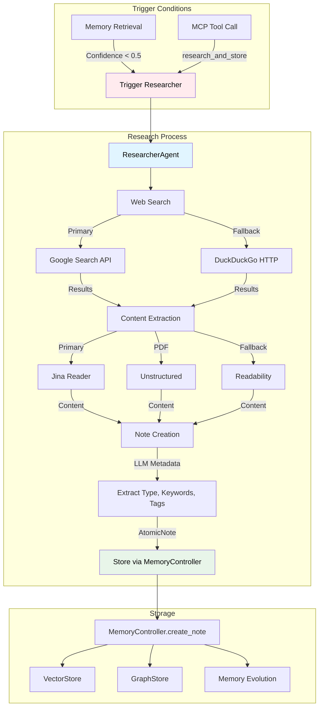
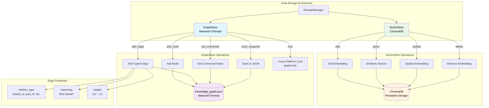
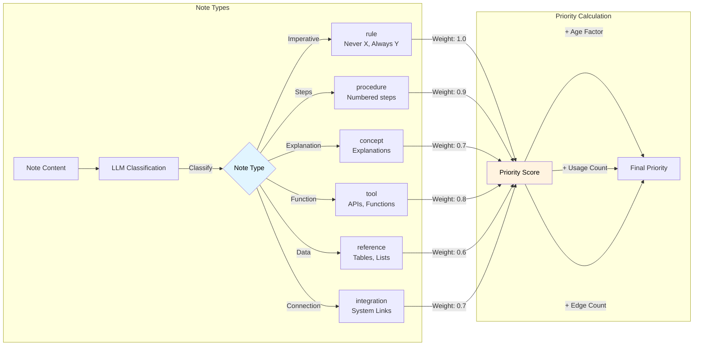

# A-MEM: Vollständige Architektur-Darstellung

## System-Architektur (Mermaid Diagram)

```mermaid
graph TB
    subgraph "MCP Server Layer"
        MCP[main.py<br/>MCP Server<br/>15 Tools]
        HTTP[HTTP Server<br/>Optional<br/>Port 42424]
    end

    subgraph "Core Logic Layer"
        MC[MemoryController<br/>core/logic.py]
        MC -->|create_note| CN[Note Creation]
        MC -->|retrieve| RET[Memory Retrieval]
        MC -->|evolve| EVO[Memory Evolution]
        MC -->|link| LINK[Automatic Linking]
    end

    subgraph "Storage Layer - Dual Architecture"
        SM[StorageManager<br/>storage/engine.py]
        SM -->|Vector Search| VS[VectorStore<br/>ChromaDB<br/>Embeddings]
        SM -->|Graph Relations| GS[GraphStore<br/>NetworkX DiGraph<br/>Typed Edges]
    end

    subgraph "LLM Service Layer"
        LLM[LLMService<br/>utils/llm.py]
        LLM -->|Metadata Extraction| META[Type Classification<br/>Keywords, Tags, Summary]
        LLM -->|Embeddings| EMB[Text Embeddings<br/>nomic-embed-text]
        LLM -->|Text Generation| GEN[Text Generation<br/>qwen3:4b / GPT-4o-mini]
    end

    subgraph "Advanced Features"
        PRIO[Priority Scoring<br/>utils/priority.py<br/>Type, Age, Usage, Edges]
        ENZ[Memory Enzymes<br/>utils/enzymes.py]
        ENZ -->|Maintenance| LP[Link Pruner<br/>Old/Weak Links]
        ENZ -->|Discovery| RS[Relation Suggester<br/>New Connections]
        ENZ -->|Compression| SD[Summary Digester<br/>Overcrowded Nodes]
        ENZ -->|Cleanup| ZNR[Zombie Node Remover<br/>Empty Nodes]
        ENZ -->|Validation| NV[Note Validator]
        ENZ -->|Merging| DM[Duplicate Merger]
        ENZ -->|Linking| INL[Isolated Node Linker]
    end

    subgraph "Researcher Agent"
        RA[ResearcherAgent<br/>utils/researcher.py]
        RA -->|Web Search| WS[Web Search Module]
        RA -->|Content Extract| CE[Content Extraction]
        RA -->|Note Creation| NC[Research Note Creation]
        WS -->|Primary| GSAPI[Google Search API]
        WS -->|Fallback| DDG[DuckDuckGo HTTP]
        CE -->|Primary| JINA[Jina Reader<br/>Local Docker / Cloud]
        CE -->|PDF| UNSTR[Unstructured<br/>Library / API]
        CE -->|Fallback| READ[Readability]
    end

    subgraph "Background Processes"
        SCHED[Enzyme Scheduler<br/>Hourly Maintenance]
        AUTO[Auto-Save Task<br/>5min Interval]
        SCHED -->|Trigger| ENZ
        AUTO -->|Save| SM
    end

    subgraph "Event & Logging System"
        EVT[Event Logger<br/>utils/priority.py]
        EVT -->|Append-Only| JSONL[events.jsonl<br/>NOTE_CREATED<br/>RELATION_CREATED<br/>MEMORY_EVOLVED<br/>ENZYME_RUN]
    end

    subgraph "External Providers"
        OLLAMA[Ollama<br/>Local Models<br/>localhost:11434]
        OR[OpenRouter<br/>Cloud LLMs<br/>API Gateway]
        JINA_EXT[Jina Reader<br/>Docker / Cloud]
        UNSTR_EXT[Unstructured<br/>PDF Extraction]
        GOOGLE[Google Search API<br/>Custom Search]
    end

    subgraph "Data Models"
        AN[AtomicNote<br/>models/note.py<br/>Content, Summary, Keywords, Tags, Type, Metadata]
        NR[NoteRelation<br/>models/note.py<br/>Type, Reasoning, Weight]
        NI[NoteInput<br/>models/note.py<br/>Input Data Structure]
        SR[SearchResult<br/>models/note.py<br/>Note + Score + Priority]
    end

    subgraph "File System"
        CHROMA[data/chroma/<br/>Vector Database]
        GRAPH[data/graph/<br/>knowledge_graph.json<br/>NetworkX Format]
        EVENTS[data/events.jsonl<br/>Event Log]
        LOCK[data/graph/graph.lock<br/>Cross-Platform Locking]
    end

    %% MCP Server Connections
    MCP -->|15 Tools| MC
    HTTP -->|Graph Export| SM

    %% Core Logic Connections
    CN -->|Metadata| LLM
    CN -->|Store| SM
    CN -->|Trigger| EVO
    RET -->|Vector Search| VS
    RET -->|Graph Traversal| GS
    RET -->|Low Confidence| RA
    RET -->|Priority| PRIO
    EVO -->|Find Similar| VS
    EVO -->|Create Links| GS
    LINK -->|Semantic Similarity| VS
    LINK -->|Add Edges| GS

    %% Storage Connections
    VS -->|Persist| CHROMA
    GS -->|Persist| GRAPH
    GS -->|Lock| LOCK

    %% LLM Service Connections
    LLM -->|Ollama| OLLAMA
    LLM -->|OpenRouter| OR

    %% Researcher Connections
    RA -->|Search| WS
    RA -->|Extract| CE
    RA -->|Create| NC
    NC -->|Store| MC
    GSAPI -->|API| GOOGLE
    JINA -->|Local| JINA_EXT
    JINA -->|Cloud| JINA_EXT
    UNSTR -->|Library| UNSTR_EXT
    UNSTR -->|API| UNSTR_EXT

    %% Background Processes
    MC -->|Start| SCHED
    MC -->|Start| AUTO

    %% Event Logging
    CN -->|Log| EVT
    EVO -->|Log| EVT
    ENZ -->|Log| EVT
    RA -->|Log| EVT
    EVT -->|Write| EVENTS

    %% Data Models Usage
    CN -->|Create| AN
    RET -->|Return| SR
    EVO -->|Create| NR
    AN -->|Store| SM
    NR -->|Store| GS

    %% Styling
    classDef mcpLayer fill:#e1f5ff,stroke:#01579b,stroke-width:2px,color:#000000
    classDef coreLayer fill:#f3e5f5,stroke:#4a148c,stroke-width:2px,color:#000000
    classDef storageLayer fill:#e8f5e9,stroke:#1b5e20,stroke-width:2px,color:#000000
    classDef llmLayer fill:#fff3e0,stroke:#e65100,stroke-width:2px,color:#000000
    classDef featureLayer fill:#fce4ec,stroke:#880e4f,stroke-width:2px,color:#000000
    classDef externalLayer fill:#f1f8e9,stroke:#33691e,stroke-width:2px,color:#000000
    classDef dataLayer fill:#e0f2f1,stroke:#004d40,stroke-width:2px,color:#000000

    class MCP,HTTP mcpLayer
    class MC,CN,RET,EVO,LINK coreLayer
    class SM,VS,GS,CHROMA,GRAPH,LOCK storageLayer
    class LLM,META,EMB,GEN llmLayer
    class PRIO,ENZ,LP,RS,SD,ZNR,NV,DM,INL featureLayer
    class OLLAMA,OR,JINA_EXT,UNSTR_EXT,GOOGLE externalLayer
    class AN,NR,NI,SR dataLayer
```

## Workflow-Diagramm: Note Creation & Retrieval

## Memory Enzymes Workflow

## Researcher Agent Workflow

## Storage Architecture Detail

## Type Classification System

## MCP Tools Overview

```mermaid
graph TB
    subgraph "Core Memory Operations"
        T1[create_atomic_note]
        T2[retrieve_memories]
        T3[get_memory_stats]
        T4[add_file]
        T5[reset_memory]
    end

    subgraph "Note Management"
        T6[list_notes]
        T7[get_note]
        T8[update_note]
        T9[delete_atomic_note]
    end

    subgraph "Relation Management"
        T10[list_relations]
        T11[add_relation]
        T12[remove_relation]
    end

    subgraph "Graph Operations"
        T13[get_graph]
    end

    subgraph "Memory Maintenance"
        T14[run_memory_enzymes]
    end

    subgraph "Research & Web"
        T15[research_and_store]
    end

    T1 --> MC[MemoryController]
    T2 --> MC
    T3 --> MC
    T4 --> MC
    T5 --> MC
    T6 --> MC
    T7 --> MC
    T8 --> MC
    T9 --> MC
    T10 --> MC
    T11 --> MC
    T12 --> MC
    T13 --> MC
    T14 --> MC
    T15 --> RA[ResearcherAgent]

    style T1 fill:#e8f5e9,color:#000000
    style T2 fill:#e8f5e9,color:#000000
    style T14 fill:#fff3e0,color:#000000
    style T15 fill:#f3e5f5,color:#000000
```

---

**Erstellt:** 2025-01-XX  
**Version:** 1.0  
**Basierend auf:** A-MEM Agentic Memory System Implementation

