# A-MEM Framework - Extended Architecture Diagram

```mermaid
graph TB
    subgraph "User / IDE Integration"
        IDE[IDE / Cursor / VSCode]
        MCP[MCP Server<br/>15 Tools]
        IDE -->|MCP Protocol| MCP
    end

    subgraph "A-MEM Core System"
        subgraph "Phase 1: Note Construction"
            INPUT[User Input / File]
            INPUT -->|Content| CONSTRUCT[Note Construction]
            CONSTRUCT -->|LLM Extraction| METADATA[Metadata Extraction<br/>- Summary<br/>- Keywords<br/>- Tags<br/>- Type Classification]
            METADATA -->|Create| ATOMIC[AtomicNote]
        end

        subgraph "Phase 2: Memory Processing"
            ATOMIC -->|Store| PROCESSING[Memory Processing]
            
            subgraph "Dual Storage Architecture"
                PROCESSING -->|Vector Search| CHROMADB[ChromaDB<br/>Vector Store]
                PROCESSING -->|Graph Relations| NETWORKX[NetworkX DiGraph<br/>Typed Edges<br/>- relation_type<br/>- reasoning<br/>- weight]
            end
            
            PROCESSING -->|Auto-Link| LINKING[Link Generation<br/>Semantic Similarity]
            LINKING -->|Update| EVOLUTION[Memory Evolution<br/>Dynamic Updates]
            
            subgraph "Researcher Agent (JIT Research)"
                LOW_CONF[Low Confidence<br/>Detection]
                LOW_CONF -->|Trigger| RESEARCHER[Researcher Agent]
                RESEARCHER -->|Web Search| SEARCH[Search Engine<br/>Google API / DuckDuckGo]
                SEARCH -->|Extract| EXTRACT[Content Extraction<br/>Jina Reader / Unstructured]
                EXTRACT -->|Create Notes| RESEARCH_NOTES[Research Notes]
                RESEARCH_NOTES -->|Store| PROCESSING
            end
        end

        subgraph "Phase 3: Memory Retrieval"
            QUERY[User Query]
            QUERY -->|Search| RETRIEVE[Semantic Retrieval]
            RETRIEVE -->|Vector Search| CHROMADB
            RETRIEVE -->|Graph Traversal| NETWORKX
            RETRIEVE -->|Calculate| PRIORITY[Priority Scoring<br/>- Type Weight<br/>- Age Factor<br/>- Usage Count<br/>- Edge Count]
            PRIORITY -->|Rank| RESULTS[Ranked Results]
            RESULTS -->|Check Confidence| LOW_CONF
        end

        subgraph "Memory Enzymes (Automatic Maintenance)"
            SCHEDULER[Automatic Scheduler<br/>Hourly]
            SCHEDULER -->|Trigger| ENZYMES[Memory Enzymes]
            
            subgraph "Enzyme Functions"
                ENZYMES --> PRUNE[Link Pruner<br/>Remove old/weak edges]
                ENZYMES --> ZOMBIE[Zombie Remover<br/>Remove empty nodes]
                ENZYMES --> DUPLICATE[Duplicate Merger<br/>Merge identical notes]
                ENZYMES --> VALIDATE[Note Validator<br/>Validate & correct]
                ENZYMES --> SUGGEST[Relation Suggester<br/>Find new connections]
                ENZYMES --> REFINE[Summary Refiner<br/>Make summaries specific]
                ENZYMES --> LINK_ISO[Isolated Linker<br/>Link isolated nodes]
                ENZYMES --> DIGEST[Summary Digester<br/>Compress overcrowded nodes]
            end
            
            PRUNE -->|Update| NETWORKX
            ZOMBIE -->|Update| NETWORKX
            DUPLICATE -->|Update| NETWORKX
            VALIDATE -->|Update| NETWORKX
            SUGGEST -->|Add| NETWORKX
            REFINE -->|Update| NETWORKX
            LINK_ISO -->|Add| NETWORKX
            DIGEST -->|Update| NETWORKX
        end

        subgraph "Event Logging"
            EVENTS[Event Log<br/>JSONL Format]
            CONSTRUCT -->|Log| EVENTS
            LINKING -->|Log| EVENTS
            EVOLUTION -->|Log| EVENTS
            RESEARCHER -->|Log| EVENTS
            ENZYMES -->|Log| EVENTS
            SCHEDULER -->|Log| EVENTS
        end

        subgraph "Auto-Save System"
            AUTO_SAVE[Auto-Save Loop<br/>Every 5 minutes]
            AUTO_SAVE -->|Save| SNAPSHOT[Graph Snapshot<br/>data/graph/knowledge_graph.json]
        end
    end

    subgraph "External Services"
        GOOGLE[Google Search API]
        DUCKDUCKGO[DuckDuckGo HTTP]
        JINA[Jina Reader<br/>Local Docker / Cloud]
        UNSTRUCTURED[Unstructured<br/>PDF Extraction]
        
        SEARCH --> GOOGLE
        SEARCH --> DUCKDUCKGO
        EXTRACT --> JINA
        EXTRACT --> UNSTRUCTURED
    end

    subgraph "LLM Services"
        LLM[LLM Service<br/>Ollama / OpenRouter]
        CONSTRUCT --> LLM
        METADATA --> LLM
        LINKING --> LLM
        EVOLUTION --> LLM
        RESEARCHER --> LLM
        VALIDATE --> LLM
        SUGGEST --> LLM
        REFINE --> LLM
        DIGEST --> LLM
    end

    MCP --> INPUT
    MCP --> RETRIEVE
    MCP --> PROCESSING
    MCP --> ENZYMES
    MCP --> RESEARCHER

    style IDE fill:#e1f5ff
    style MCP fill:#b3e5fc
    style CONSTRUCT fill:#c8e6c9
    style PROCESSING fill:#fff9c4
    style RETRIEVE fill:#f8bbd0
    style ENZYMES fill:#d1c4e9
    style RESEARCHER fill:#ffccbc
    style CHROMADB fill:#b2dfdb
    style NETWORKX fill:#b2dfdb
    style EVENTS fill:#f5f5f5
    style SCHEDULER fill:#e0e0e0
    style AUTO_SAVE fill:#e0e0e0
```

## Komponenten-Übersicht

### Phase 1: Note Construction
- **User Input / File**: Eingabe von Benutzer oder Datei-Import
- **Note Construction**: Erstellung der AtomicNote
- **Metadata Extraction**: LLM-basierte Extraktion von Summary, Keywords, Tags, Type
- **AtomicNote**: Finale Note-Struktur

### Phase 2: Memory Processing
- **Dual Storage**: ChromaDB (Vektoren) + NetworkX (Graph)
- **Link Generation**: Automatische Verlinkung ähnlicher Notes
- **Memory Evolution**: Dynamische Updates bestehender Notes
- **Researcher Agent**: JIT Research bei niedriger Confidence

### Phase 3: Memory Retrieval
- **Semantic Retrieval**: Vektor- und Graph-basierte Suche
- **Priority Scoring**: Dynamische Priorisierung der Ergebnisse
- **Low Confidence Detection**: Trigger für Researcher Agent

### Memory Enzymes
- **Automatic Scheduler**: Stündliche Ausführung
- **8 Enzyme-Funktionen**: Automatische Graph-Pflege
- **Auto-Save**: Periodisches Speichern (alle 5 Minuten)

### Event Logging
- **JSONL Format**: Append-only Event Log
- **Alle Operationen**: Vollständiger Audit Trail

### External Services
- **Google Search API**: Web-Suche
- **DuckDuckGo**: Fallback für Web-Suche
- **Jina Reader**: Content-Extraktion
- **Unstructured**: PDF-Extraktion

### LLM Services
- **Ollama / OpenRouter**: Multi-Provider Support
- **Verwendung**: In allen Phasen für Extraktion, Linking, Evolution, Research, Enzymes

